## Challenge #5: Bypassing referrer based defense

Challenge link: https://portswigger.net/web-security/csrf/bypassing-referer-based-defenses/lab-referer-validation-depends-on-header-being-present

### Explication:

J'ai d'abord remarqué que la requête était refusé quand on modifiait la valeur du header **referrer** mais qu'elle était accepté quand elle il était supprimer:

Avant:

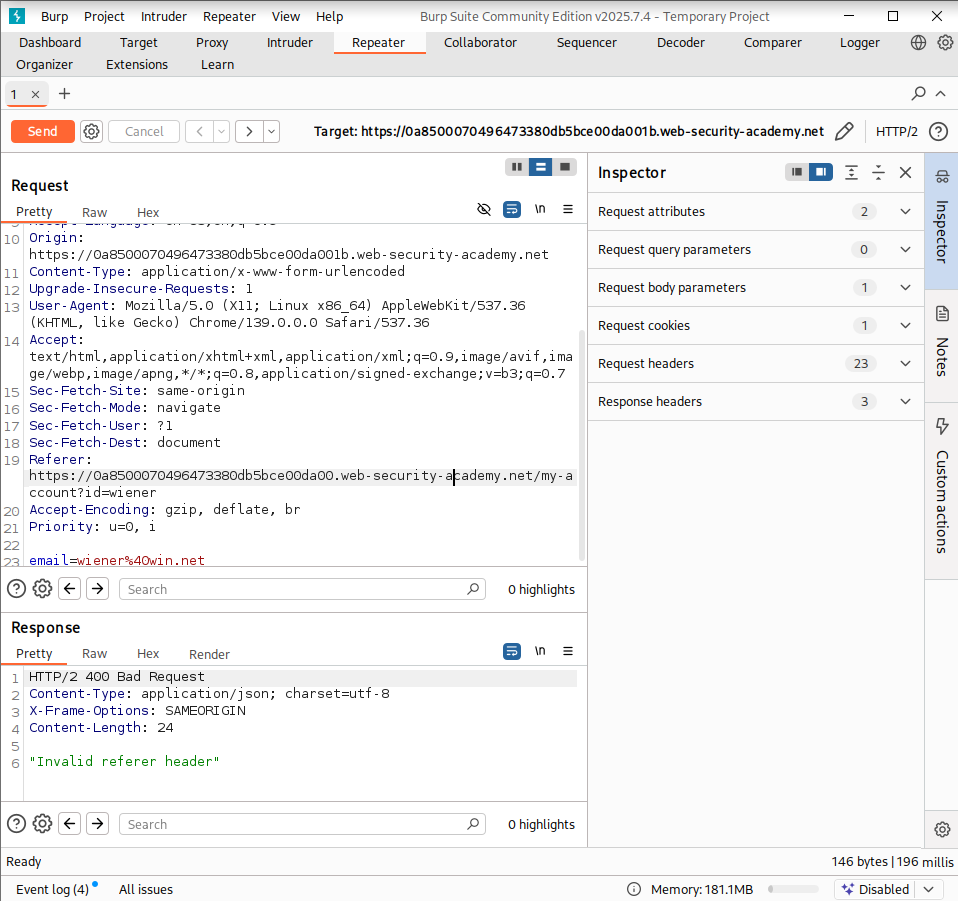

Après:

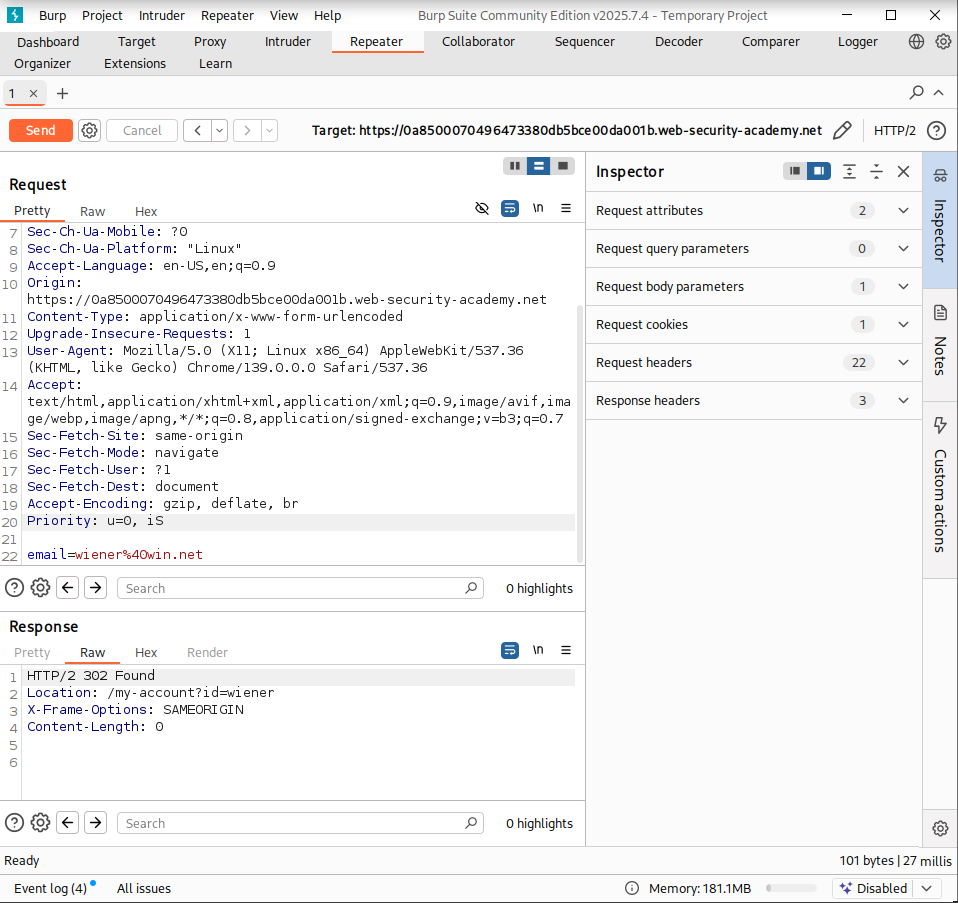

### Solution:

J'ai donc trouvé un moyen pour retirer le header referrer dans le html:

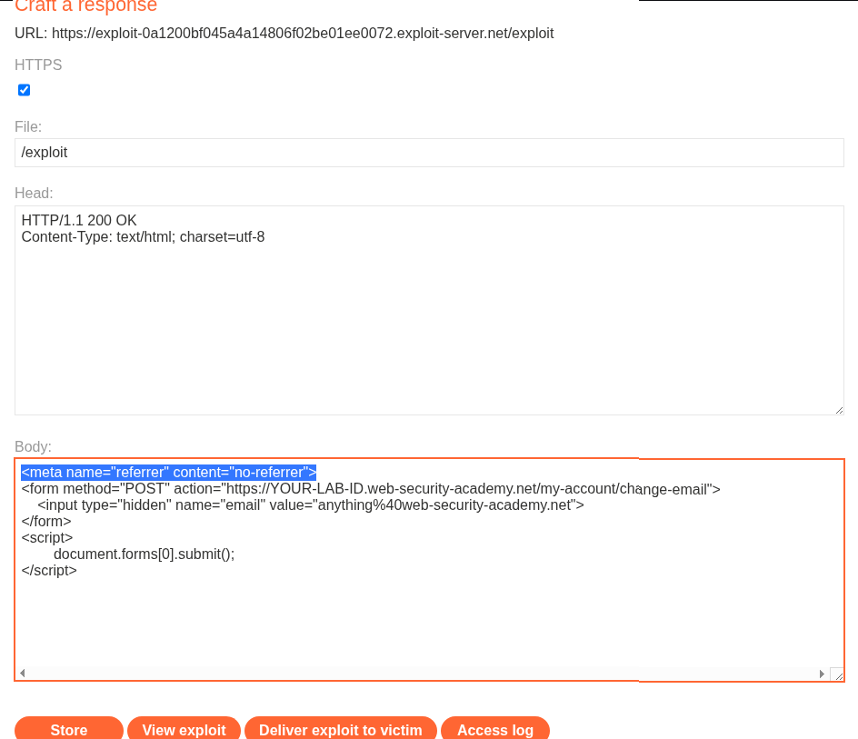

Il reste plus qu'à changer l'email et envoyer l'exploit à la victime

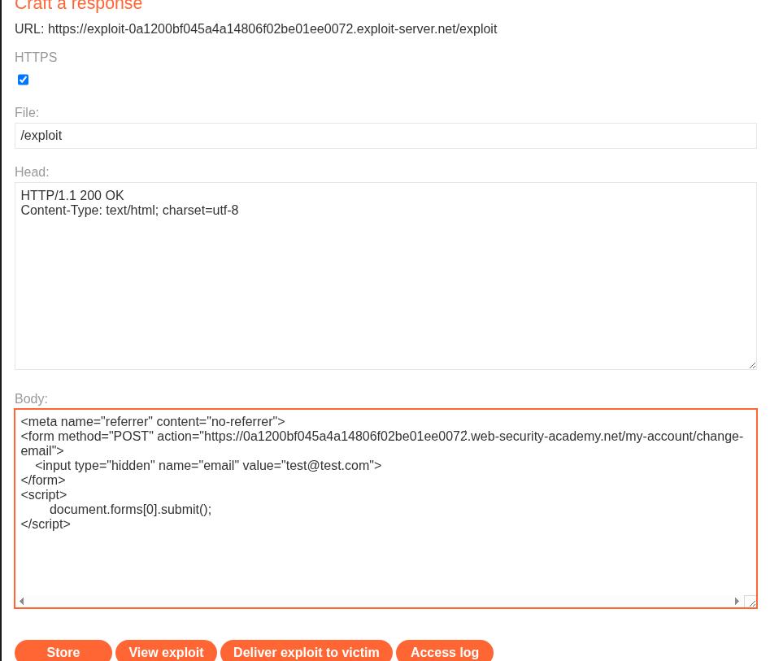

## Challenge #6: Jwt Revoke

Challenge link: https://www.root-me.org/fr/Challenges/Web-Serveur/JWT-Jeton-revoque

Connexion en tant qu'admin pour récupérer le token jwt

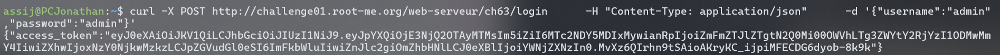

Tentative d'accès à la page [...] échouée car le token a été blacklisté

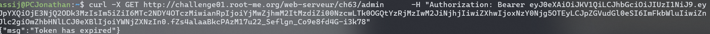

Nouvelle tentative d'accès à la page admin avec une modification du nouveau token avec `'=='` car lors du décodage, `'=='` est retiré ce qui donne la même signature.

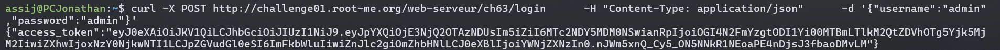

Succès !!!

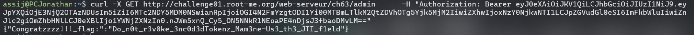

## Challenge #7: SQL injection - Error

Challenge link: https://www.root-me.org/fr/Challenges/Web-Serveur/SQL-injection-Error?lang=fr

Premier essai d'injection via les inputs du formulaire de connexion raté

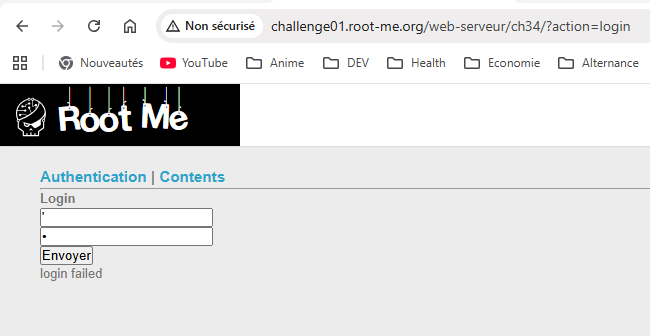

On passe à la page *contents* et on remarque qu'il y a `order=ASC` ce qui nous fait penser à du sql

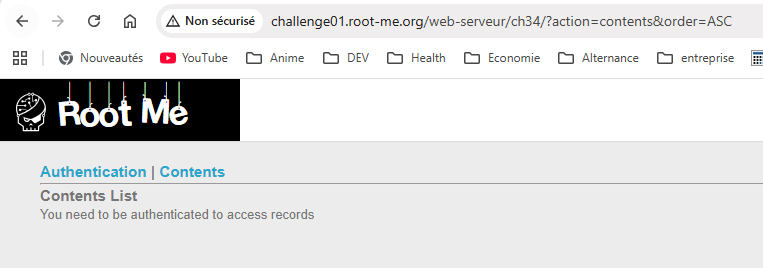

On essaie maintenant d'afficher la version du sgbd pour voir si on a une faille exploitable

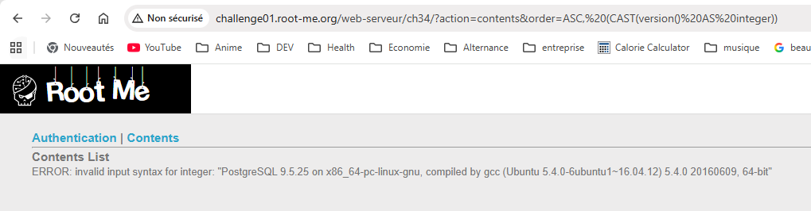

Maintenant qu'on sait que c'est du postgres, on essaie de voir le nom des tables

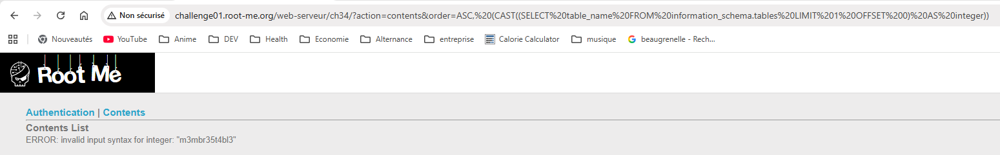

Après avoir trouvé la table qui nous intéresse, on cherche maintenant le nom des colonnes. On peut les faire défiler en changeant la valeur du OFFSET après le %20. Il faut bien faire attention à mettre le `$$ $$` autour du nom de la table car le sgbd se protège des quote et des guillemets quand il lit du texte.

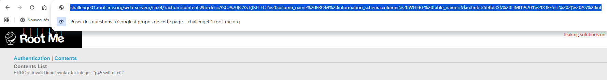

Après avoir trouvé les colonnes qui nous intéressent, on vérifie quels utilisateurs sont dans la table `m3mbr35t4bl3`

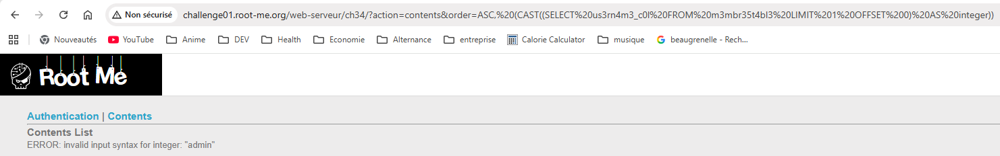

Comme on a trouvé l'utilisateur qu'il nous fallait, on récupère son mot de passe en faisant `WHERE 0us3rn4m3_c0l='admin'`

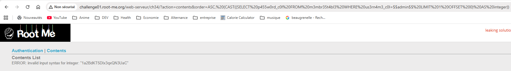

## Challenge #8: Os Command Injection

challenge link: https://www.root-me.org/fr/Challenges/Web-Serveur/Injection-de-commande-Contournement-de-filtre

## Explication:

J'ai essayé d'injecter une commande os directement dans l'input mais les caractères spéciaux étaient filtrés:

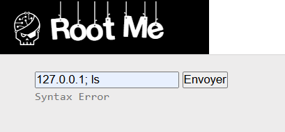

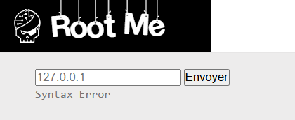

J'ai ensuite pensé à passer par curl mais comme la page n'affichait pas le code php, j'ai pensé à utiliser un service comme interactsh.com qui agit comme un propre site hébergé, afin de rediriger le résultat du curl injecté sur mon site.

Comme les caractères spéciaux étaient filtrés, je suis passé par %0a qui est la représentation web de la touche "Entrée". Vu qu'on voulait lire le contenu du fichier index.php, il a fallut le spécifier '@index.php' entre *simple quotes* et avec un *@* devant, ce qui va forcer le serveur à lire le fichier et envoyer son contenu.

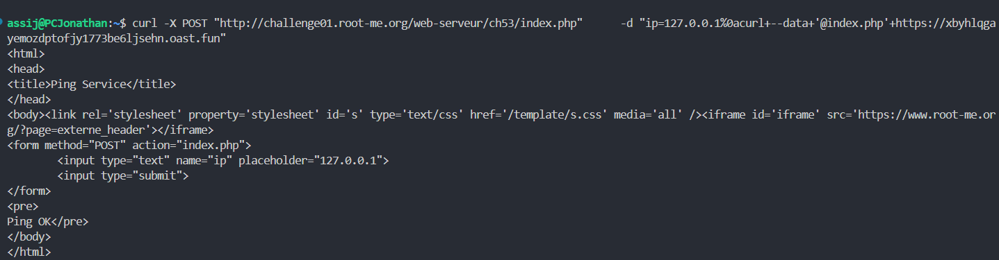

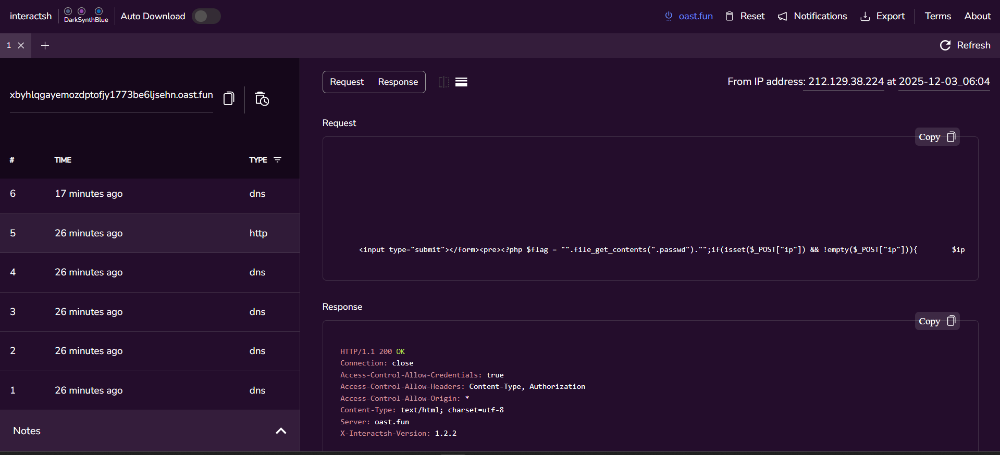

Dans l'image précédente, on peut voir un bout de code sensible `file_get_contents(".passwd")`. Cette fonction php sert à lire le contenu d'un fichier et .passwd est un fichier qui contient des mots de passes.

On répète la même opération qu'avant pour lire le contenu de .passwd et on finit par trouver le mot de passe.

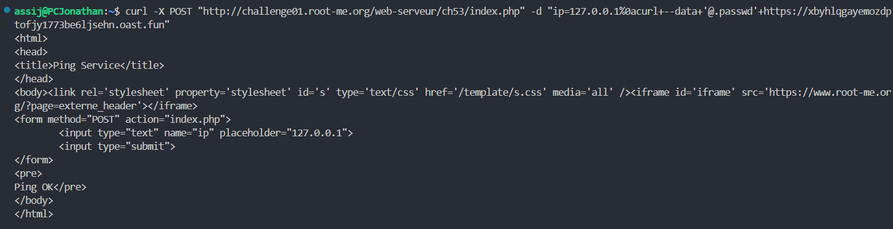

